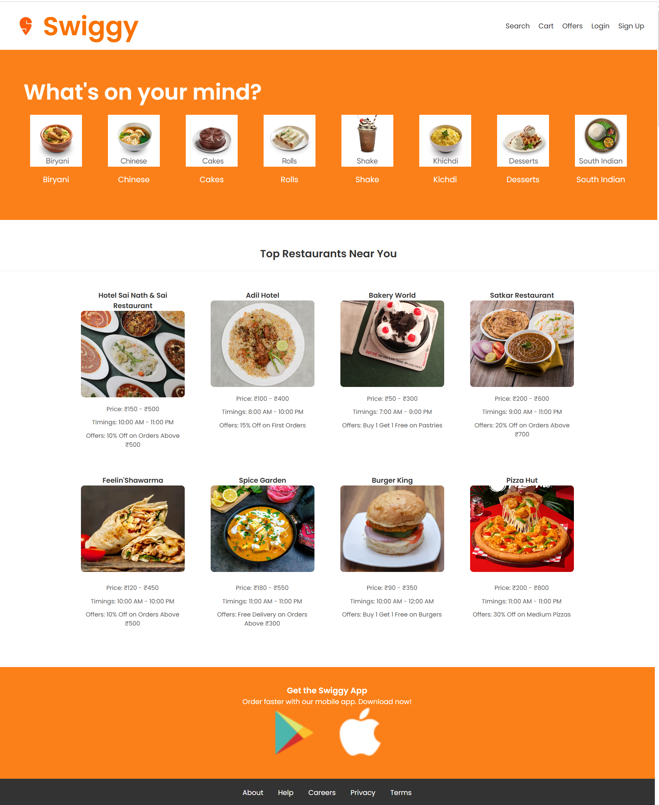

# Swiggy-clone

This is a frontend clone of the [Swiggy](https://www.swiggy.com) homepage, created for learning and practice purposes. It uses basic **HTML** and **CSS** to replicate the structure and layout of the real Swiggy site.

##  Features

- Responsive navbar with logo and links
- Hero section with food categories
- Clean and modern layout inspired by Swiggy

##  Project Structure

project-folder/
* index.html # Main HTML file
* style.css # CSS styling
* images/ # (Optional) Folder for icons or assets

##  Screenshot

 

##  Tech Stack

- HTML5
- CSS3
- (No frameworks or JavaScript used)

##  Disclaimer

This project is **not affiliated** with Swiggy in any way. It is an unofficial clone built purely for **educational and portfolio** purposes. All trademarks and copyrights belong to their respective owners.

##  Contact

If you have any questions or suggestions, feel free to reach out!

